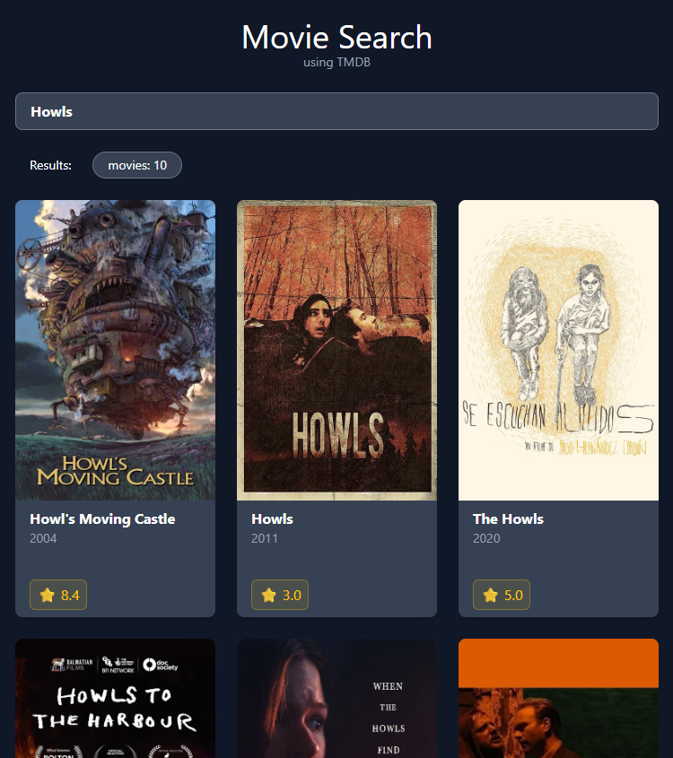

# Movie Search

## Overview
A movie search app that displays cover posters, titles, release years, 
and ratings for any film using the TMDB API.

## Preview

## Tech Stack

* Vite
* React + TypeScript
* TailwindCSS
* TMDB API

## Features

* Displays movies based on user search

* Search bar with debouncing 
* Loading bar animation during loading state
* Movie display breakpoints at different screen sizes

## Concepts Practiced

* Debouncing on search
* Live searching using TMDB API
* Loading states
* Error handling with response.ok
* Results rendered using .map(), .filter() and slice() into MovieCard components

## Setup

1. Clone the repo
2. Run `npm install`
3. Create a `.env` file in the root with:
   VITE_TMDB_TOKEN=your_token_here
4. Get a free token at themoviedb.org
5. Run `npm run dev`

## Roadmap

* [ ] allow user to hover over movie poster to read the overview
* [ ] allow user to click on the movie card to open an external link to watch that movie
* [ ] allow users to search / filter movies based of genre buttons
